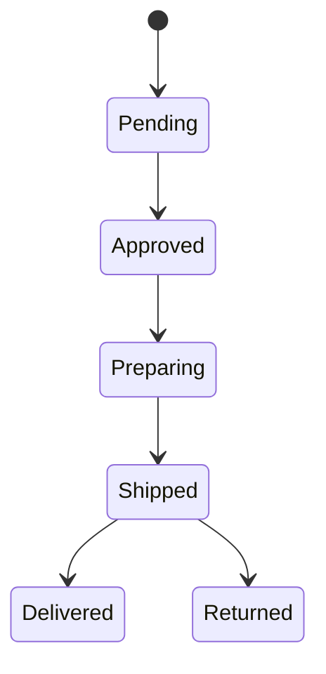
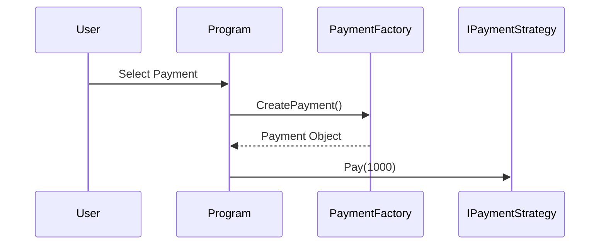
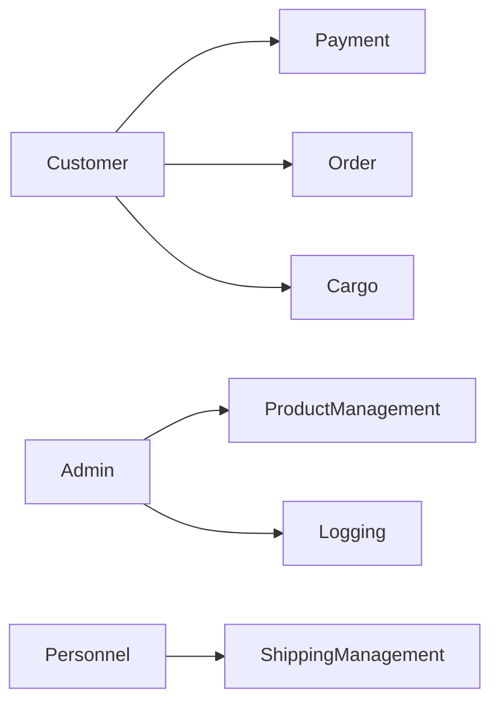
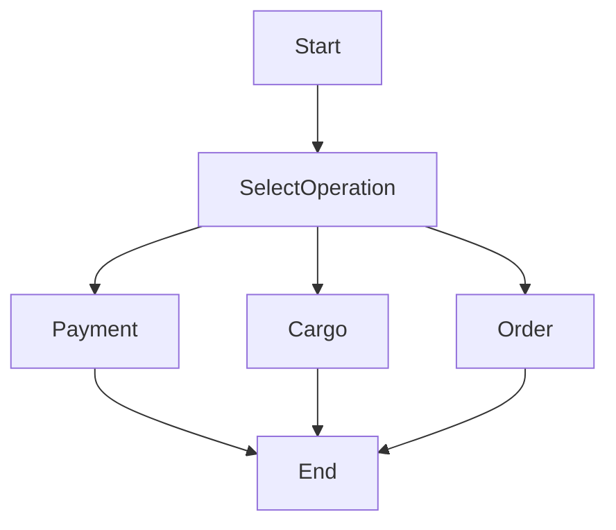

# 🚀 LogicSystems

A console-based application demonstrating multiple software design patterns within a layered architecture using C# and .NET 10.

---

## 📌 Project Overview

LogicSystems is a modular and extensible application designed to simulate a logistics/order management system.  
It showcases best practices in software design by applying several **design patterns** and a **clean layered architecture**.

---

## 🏗️ Architecture

The project follows a **Layered Architecture**:

ConsoleUI → Business → Core
                     ↓
                    Data
### 🔹 Layers

- **ConsoleUI**
  - Entry point of the application
  - Handles user interaction via console

- **Business**
  - Contains business logic
  - Implements design patterns

- **Core**
  - Defines domain models (Product, Order, User)

- **Data**
  - Handles data-related operations (Logger, Repository)
    
- **Tests**
  - Payment factory behavior
  - State transitions
  - Shipping decorators and adapters
---

## 🎯 Implemented Design Patterns

### ✅ Strategy Pattern
- IPaymentStrategy
- CreditCardPayment
- BankTransferPayment

### ✅ Factory Pattern
- PaymentFactory
- ShippingFactory

### ✅ State Pattern
- IOrderState
- PendingState
- ApprovedState
- ShippedState
- DeliveredState
- OrderContext

### ✅ Adapter Pattern
- IShippingService
- ArasAdapter
- YurtiçiAdapter
- ArasCargoAPI
- YurtiçiCargoAPI

### ✅ Decorator Pattern
- ShippingDecorator
- InsuranceDecorator
- FragileDecorator

### ✅ Observer Pattern
- IObserver
- EmailNotifier
- StockManager

### ✅ Singleton Pattern
- Logger

---

## ⚙️ Features

- Multiple payment options  
- Order lifecycle management  
- Cargo system with dynamic pricing  
- Observer-based notification system  
- Extensible and modular design  
- Clean separation of concerns  

---

## 📄 Report

Project report:

[LogicSystems_Report.pdf](docs/NESNE YÖNELİMLİ ANALİZ VE TASARIM PROJESİ.pdf.pdf)

---

## ▶️ How to Run
```
git clone https://github.com/your-username/LogicSystems.git
```
Open the solution in Visual Studio  
Set ConsoleUI project as Startup Project  

Build:
Build → Rebuild Solution

Run:
```
Ctrl + F5
```
---

## 🖥️ Sample Output
```
===================================
     LOGIC SYSTEMS APPLICATION
===================================

1 - Payment
2 - Order
3 - Cargo
4 - Products
0 - Exit
```
---

## 📂 Project Structure
```
LogicSystems
│
├── LogicSystems.ConsoleUI
│   └── Program.cs
│
├── LogicSystems.Business
│   ├── Factories
│   ├── Strategies
│   ├── States
│   ├── Shipping
│   │   ├── Adapters
│   │   ├── Decorators
│   │   └── ExternalAPIs
│   ├── Observer
│   └── Services
│
├── LogicSystems.Core
│   ├── Product.cs
│   ├── Order.cs
│   └── User.cs
│
├── LogicSystems.Data
│   ├── Logger.cs
│   └── ProductRepository.cs
```

---

## State Diagram



---

## Sequence Diagram


---

## Use Case Diagram


---

## Activity Diagram


---

## 🧱 SOLID Principles

The project follows several SOLID principles:

- Single Responsibility Principle
- Open/Closed Principle
- Dependency Inversion Principle

Example:
Shipping adapters depend on the abstraction `IShippingService`
instead of concrete implementations.
---

## 🧠 Key Learnings

- Application of multiple design patterns in a real-world scenario  
- Importance of separation of concerns  
- Benefits of modular and extensible architecture  
- Managing dependencies between layers  

---

## 📌 Notes

- The original console project was removed and recreated to resolve configuration and startup issues.
- All layers were converted into class libraries except the console application.
- Supports both simple and complex products
- File-based logging system

---

## 👨‍💻 Author

Burak Kahveci
