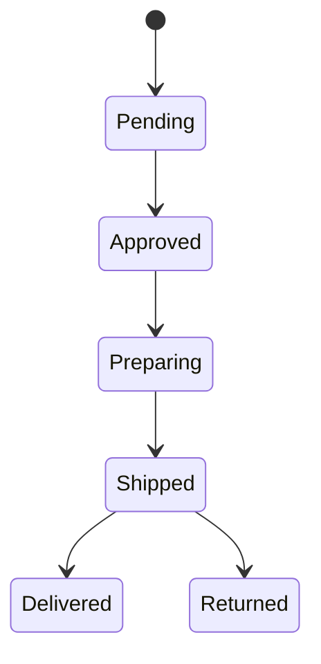
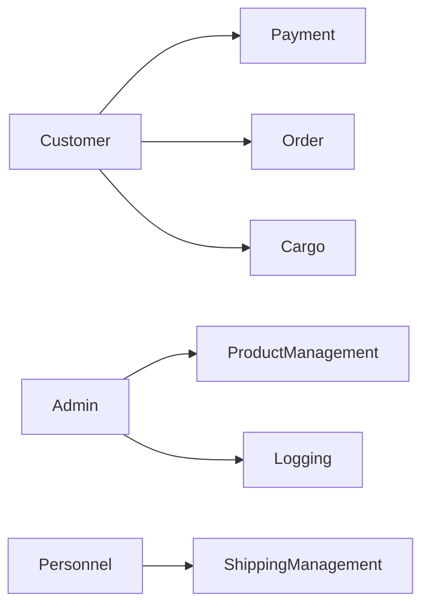
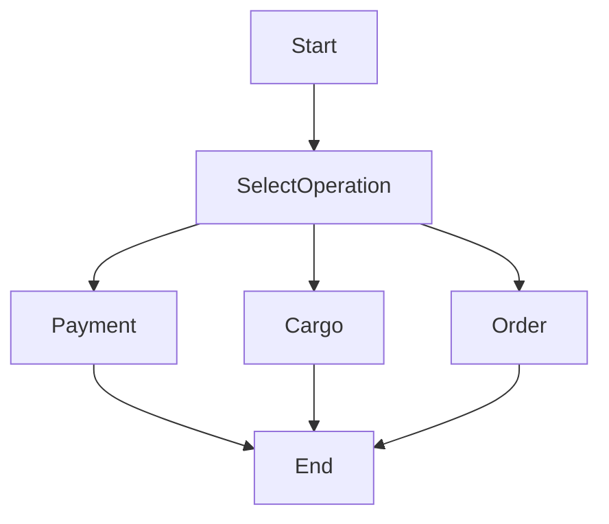

# 🚀 LogicSystems

A comprehensive .NET 10 Windows Forms application demonstrating advanced design patterns and architectural best practices for order management, payment processing, and cargo tracking.

---

## 📌 Project Overview

LogicSystems is a multi-layered enterprise application built with .NET 10 that implements industry-standard design patterns and follows clean architecture principles. It provides a complete order management system with integrated payment processing and cargo tracking capabilities through an intuitive Windows Forms interface.

---

## 🏗️ Architecture

The project follows a **Clean Layered Architecture** with Dependency Injection:

```
WinFormsUI (Presentation)
    ↓
Business (Domain & Patterns)
    ↓
Core (Models) + Data (Repository & Logging)
```

### 🔹 Layers

- **LogicSystems.WinFormsUI**
  - Windows Forms desktop application
  - Multiple user interface forms for different operations
  - Centralized Dependency Injection container setup
  - Service-aware form instantiation

- **LogicSystems.Business**
  - Core business logic and domain rules
  - Design pattern implementations
  - Service classes (OrderService, PaymentService, CargoService)
  - Factory, Strategy, and State implementations

- **LogicSystems.Core**
  - Domain models (Order, Product, User, Computer)
  - Business entity definitions
  - Pure business models without external dependencies

- **LogicSystems.Data**
  - Data access and persistence layer
  - Logger service with automatic file-based logging
  - ProductRepository for data operations
  - Automatic directory creation and error handling

- **LogicSystems.Tests**
  - Comprehensive unit test coverage
  - Payment factory behavior tests
  - Order state transition tests
  - Shipping decorator pattern tests
  - Adapter integration tests
---

## 🎯 Implemented Design Patterns

### ✅ State Pattern
- **Purpose**: Manage order lifecycle through different states
- **Implementation**: `OrderContext` with `IOrderState` interface
- **Order Flow**: Pending → Approved → Preparing → Shipped → Delivered or Returned
- **Files**: `OrderContext.cs`, `States/` directory

### ✅ Strategy Pattern
- **Purpose**: Support multiple payment methods interchangeably
- **Interface**: `IPaymentStrategy`
- **Implementations**: 
  - `CreditCardPayment` - Credit card transactions
  - `BankTransferPayment` - Bank transfer payments
- **Factory**: `PaymentFactory` for strategy creation

### ✅ Factory Pattern
- **Purpose**: Centralize and encapsulate object creation
- **Implementations**: 
  - `PaymentFactory` - Creates appropriate payment strategy
  - `ShippingFactory` - Creates appropriate shipping adapter

### ✅ Decorator Pattern
- **Purpose**: Add features dynamically to shipping services
- **Base**: `ShippingDecorator` abstract class
- **Concrete Decorators**: 
  - `InsuranceDecorator` - Adds insurance coverage with additional cost
  - `FragileDecorator` - Adds fragile item handling with special care
- **Composable**: Multiple decorators can be stacked

### ✅ Adapter Pattern
- **Purpose**: Integrate with third-party cargo delivery APIs
- **Interface**: `IShippingService`
- **Adapters**: 
  - `ArasAdapter` - Aras Cargo service integration
  - `YurtiçiAdapter` - Yurtiçi Cargo service integration
- **External APIs**: `ArasCargoAPI`, `YurtiçiCargoAPI`

### ✅ Observer Pattern
- **Purpose**: Implement event-driven notifications
- **Interface**: `IObserver`
- **Concrete Observers**: 
  - `EmailNotifier` - Email notifications
  - `SystemNotifier` - System notifications
  - `StockManager` - Inventory management
- **Use Case**: Order status changes trigger observer notifications

### ✅ Repository Pattern
- **Purpose**: Abstract data access logic
- **Implementation**: `ProductRepository`
- **Benefit**: Decouples business logic from data access

### ✅ Dependency Injection
- **Container**: `Microsoft.Extensions.DependencyInjection`
- **Scopes**: 
  - Scoped for services (OrderService, PaymentService, CargoService)
  - Transient for UI forms
- **Benefits**: Loose coupling, testability, centralized configuration

---

## ⚙️ Features

### Order Management
- Create and manage orders through complete lifecycle
- State-based order transitions with validation
- Order history and status tracking
- Multiple products per order support

### Payment Processing
- Multiple payment methods (Credit Card, Bank Transfer)
- Secure payment handling through strategy pattern
- Payment validation and confirmation
- Transaction logging

### Cargo Tracking
- Integration with Aras and Yurtiçi cargo services
- Dynamic feature addition (Insurance, Fragile handling)
- Real-time tracking number generation
- Flexible price calculation based on decorators

### Data Management
- Centralized logging system
- Automatic log directory creation
- Product repository for catalog management
- Absolute path handling for cross-platform compatibility

### Notifications
- Email notifications for order updates
- System-level event notifications
- Stock manager for inventory tracking
- Event-driven observer pattern implementation

### User Interface
- Professional Windows Forms application
- Intuitive form-based navigation
- Main form dashboard
- Separate forms for Orders, Payments, Cargo, Products, and Logs

---

## 📚 Proje Raporları ve Dokümantasyon

Ayrıntılı proje raporları `docs/` klasöründe bulunmaktadır:

### Raporlar
1. **[Kontrol Listesi](docs/00_KONTROL_LISTESI.md)** - Proje şartnamesine uygunluk kontrolü
2. **[Analiz Raporu](docs/01_ANALIZ_RAPORU.md)** - Gereksinim analizi ve UML diyagramları
3. **[Tasarım Raporu](docs/02_TASARIM_RAPORU.md)** - Tasarım desenleri detaylı analizi
4. **[Test Raporu](docs/03_TEST_RAPORU.md)** - Birim testleri ve kod kapsama
5. **[Proje Raporu](docs/LogicSystems_Report.docx)** - Detaylı DOCX raporu

### Prerequisites
- .NET 10 SDK
- Visual Studio 2022/2026 or Visual Studio Code
- Git

### Installation

1. Clone the repository:
```bash
git clone https://github.com/TheJeynn/LogicSystems.git
cd LogicSystems
```

2. Restore NuGet packages:
```bash
dotnet restore
```

3. Build the solution:
```bash
dotnet build
```

4. Set WinFormsUI as startup project and run:
```bash
dotnet run --project LogicSystems.WinFormsUI
```

Or in Visual Studio:
- Right-click on `LogicSystems.WinFormsUI` project
- Select "Set as Startup Project"
- Press `Ctrl + F5` to run
---

## 🖥️ Application Interface

The Windows Forms application provides multiple forms for different operations:

1. **Main Form** - Dashboard and navigation
2. **Order Form** - Create and manage orders
3. **Payment Form** - Process payments with method selection
   - Combo box for payment type (Bank Transfer / Credit Card)
   - Pay button to process transaction
   - Result display for confirmation
4. **Cargo Form** - Configure and track shipments
   - Cargo method selection (Aras / Yurtiçi)
   - Checkboxes for Insurance and Fragile handling
   - Tracking number and price calculation
5. **Products Form** - View and manage product catalog
6. **Logs Form** - View system logs and transaction history
---

## 📂 Project Structure
```
LogicSystems/
├── LogicSystems.WinFormsUI/          # Windows Forms UI Layer
│   ├── Program.cs                    # DI Container Setup
│   ├── Form1.cs                      # Main Form
│   ├── OrderForm.cs                  # Order Management
│   ├── PaymentForm.cs                # Payment Processing
│   ├── CargoForm.cs                  # Cargo Tracking
│   ├── ProductsForm.cs               # Product Catalog
│   └── LogsForm.cs                   # Logs Viewer
│
├── LogicSystems.Business/            # Business Logic Layer
│   ├── States/
│   │   ├── IOrderState.cs
│   │   ├── PendingState.cs
│   │   ├── ApprovedState.cs
│   │   ├── PreparingState.cs
│   │   ├── ShippedState.cs
│   │   ├── DeliveredState.cs
│   │   └── ReturnedState.cs
│   ├── Strategies/
│   │   ├── IPaymentStrategy.cs
│   │   ├── CreditCardPayment.cs
│   │   └── BankTransferPayment.cs
│   ├── Factories/
│   │   ├── PaymentFactory.cs
│   │   └── ShippingFactory.cs
│   ├── Shipping/
│   │   ├── IShippingService.cs
│   │   ├── Adapters/
│   │   │   ├── ArasAdapter.cs
│   │   │   └── YurtiçiAdapter.cs
│   │   ├── Decorators/
│   │   │   ├── ShippingDecorator.cs
│   │   │   ├── InsuranceDecorator.cs
│   │   │   └── FragileDecorator.cs
│   │   └── ExternalAPIs/
│   │       ├── ArasCargoAPI.cs
│   │       └── YurtiçiCargoAPI.cs
│   ├── Observer/
│   │   ├── IObserver.cs
│   │   ├── EmailNotifier.cs
│   │   ├── SystemNotifier.cs
│   │   └── StockManager.cs
│   ├── OrderContext.cs
│   ├── OrderService.cs
│   ├── PaymentService.cs
│   └── CargoService.cs
│
├── LogicSystems.Core/                # Domain Models
│   ├── Order.cs
│   ├── Product.cs
│   ├── User.cs
│   └── Computer.cs
│
├── LogicSystems.Data/                # Data Access Layer
│   ├── ProductRepository.cs
│   └── Logger.cs
│
├── LogicSystems.Tests/               # Unit Tests
│   └── (Test files)
│
└── README.md
```

---

## 🚀 Usage Examples

### Order Processing Flow
```csharp
// Create a new order
var order = new Order 
{ 
    Id = 1, 
    CustomerName = "John Doe" 
};

// Add products to order
order.AddProduct(new Product { Name = "Laptop", Price = 1000 });
order.AddProduct(new Product { Name = "Mouse", Price = 50 });

// Process payment using strategy pattern
var paymentService = new PaymentService();
var payment = PaymentFactory.CreatePayment("1"); // BankTransfer
payment.Pay(order.TotalPrice);

// Process cargo with decorators
var cargoService = new CargoService();
cargoService.ProcessCargo(); // Uses decorators for insurance + fragile

// Log the transaction
Logger.GetInstance().Log($"Order {order.Id} completed successfully");
```

### Using the Windows Forms Application

1. **Create an Order** (OrderForm)
   - Enter customer name
   - Select products
   - View total price

2. **Process Payment** (PaymentForm)
   - Select payment method from combo box (Bank Transfer / Credit Card)
   - Click Pay button
   - Receive confirmation message

3. **Arrange Cargo** (CargoForm)
   - Select cargo provider (Aras / Yurtiçi)
   - Check Insurance and/or Fragile options
   - Click Calculate to see tracking number and price

4. **View Logs** (LogsForm)
   - Check all transaction history
   - Verify operation logs
   - Monitor system activities

---

## 🧪 Running Tests

Execute unit tests:
```bash
dotnet test
```

Test coverage includes:
- Payment factory strategy creation
- Order state transitions
- Shipping decorator composition
- Adapter pattern implementations
- Observer pattern notifications

---

## 📚 Technologies & Libraries

- **.NET 10** - Latest .NET runtime
- **Windows Forms** - Desktop UI framework  
- **Microsoft.Extensions.DependencyInjection** - IoC container
- **xUnit/NUnit** - Unit testing frameworks

---

## 🔧 Configuration

### Dependency Injection Setup
The application uses Microsoft.Extensions.DependencyInjection in `Program.cs`:

```csharp
var services = new ServiceCollection();
services.AddScoped<OrderService>();
services.AddScoped<PaymentService>();
services.AddScoped<CargoService>();
services.AddScoped<ProductRepository>();
services.AddScoped<Logger>();
services.AddTransient<MainForm>();
// ... more form registrations
var serviceProvider = services.BuildServiceProvider();
```

### Logger Configuration
Logs are automatically stored in:
```
{ApplicationDirectory}/DataFiles/logs.txt
```

The `DataFiles` directory is created automatically if it doesn't exist.

---

## 📖 Design Patterns In Action

### Order State Transitions
```csharp
var order = new OrderContext(new PendingState());
order.Next();      // Pending → Approved
order.Next();      // Approved → Preparing
order.Next();      // Preparing → Shipped
order.Cancel();    // Any state → Cancelled
```

### Payment Strategy Selection
```csharp
// Strategy pattern allows runtime payment method selection
var payment = PaymentFactory.CreatePayment(userSelection);
payment.Pay(amount);  // Executes correct payment logic
```

### Cargo Decorator Composition
```csharp
var shipping = new ArasAdapter();
if (needsInsurance)
    shipping = new InsuranceDecorator(shipping);
if (isFragile)
    shipping = new FragileDecorator(shipping);

var price = shipping.CalculatePrice(weight);
```

---

## 🎓 Learning Resources

This project demonstrates:
- Professional code organization and structure
- SOLID principles in practice
- Gang of Four design pattern implementations
- Clean architecture principles
- Dependency injection and IoC patterns
- Error handling and logging strategies
- Windows Forms best practices
- Multi-layered application architecture

---

## 📄 State Diagram



---

## 📝 Recent Updates (v1.1.0)

### Improvements
- ✅ Implemented Microsoft.Extensions.DependencyInjection
- ✅ Fixed payment and cargo form selection parsing
- ✅ Added default combo box selections
- ✅ Improved error messages with exception details
- ✅ Fixed Logger absolute path handling
- ✅ Added automatic DataFiles directory creation
- ✅ Enhanced validation in UI forms

### Bug Fixes
- Fixed PaymentFactory payment type mapping
- Resolved relative path issues in Logger
- Fixed combo box parsing in PaymentForm and CargoForm
- Added missing namespace in ShippingFactory

---

## 📞 Support & Contribution

For issues and questions, please open an issue on the [GitHub repository](https://github.com/TheJeynn/LogicSystems/issues).

Contributions are welcome! Please feel free to submit a Pull Request.

---

## 👨‍💻 Author

**TheJeynn** - [GitHub Profile](https://github.com/TheJeynn)

---

## 📄 License

This project is licensed under the MIT License - see the LICENSE file for details.

---

**Last Updated:** 2024  
**Current Version:** 1.1.0  
**Target Framework:** .NET 10
---

## Use Case Diagram


---

## Activity Diagram


---

## 🧱 SOLID Principles

The project follows several SOLID principles:

- Single Responsibility Principle
- Open/Closed Principle
- Dependency Inversion Principle

Example:
Shipping adapters depend on the abstraction `IShippingService`
instead of concrete implementations.
---

## 🧠 Key Learnings

- Application of multiple design patterns in a real-world scenario  
- Importance of separation of concerns  
- Benefits of modular and extensible architecture  
- Managing dependencies between layers  

---

## 📌 Notes

- The original console project was removed and recreated to resolve configuration and startup issues.
- All layers were converted into class libraries except the console application.
- Supports both simple and complex products
- File-based logging system

---

## 👨‍💻 Author

Burak Kahveci
